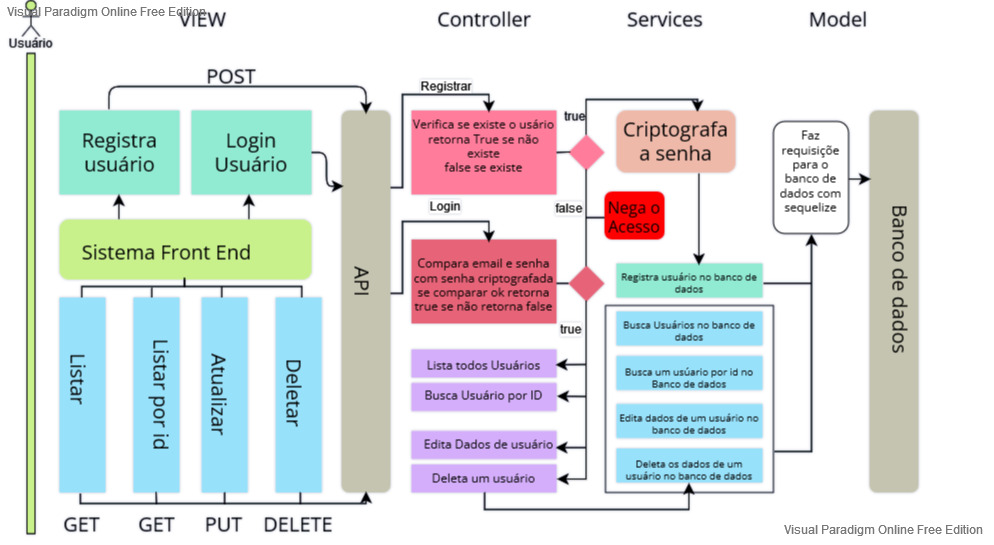
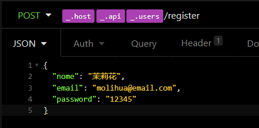
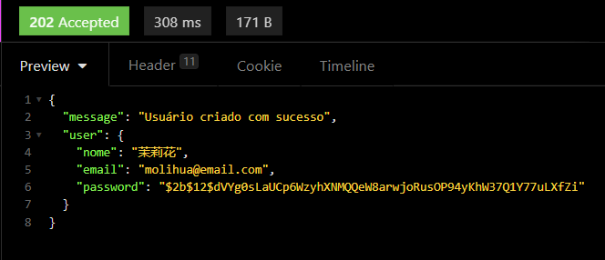
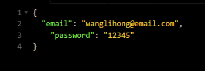
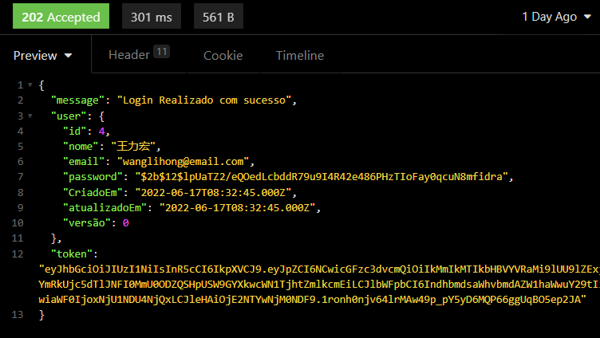
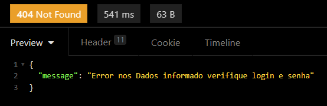

# API REST SEGURANÇA

## AUTENTIFICAÇÃO E AUTORIZAÇÃO DE USUÁRIO;

## DIAGRAMA DA API:

#### CONSTRUÇÃO

O modelo de construção desta API usa a arquitetura MVC onde se separa as requisições de dados

1. <strong>Criar Usuário:</strong>
    * Se true: usuário não existe então será criado o usuário
    * Se False: usuário existe acesso negado

2. <strong>Usuário faz o login:</strong>
    * Se True: usuário logado recebe o a autorizações
    * se False: Acesso é negado.

3. <strong>Usuáiro logado faz requisições</strong>
    * GET: busca usuários cadastrados.
    * GET por ID: busca um usuáiro cadastrado por id.
    * PUT: Edita os valores dos usuários no banco de dados.
    * DELETE: Apaga informações de um usuário no banco de dados.

### AUTENTIFICAÇÃO:

Este sistema Reque a Autentificação de usuário para acessar as rotas, a autentificação é ralizada atraves do login e senha;
O usuário envia o Login e senha para o sistema, o sistema compara a senha com a senha criptografadas que está salva na base do banco de dados. Esta criptografia foi realizada com o bcrypt. assim que o sistema identifica a criptografia confere com a senha e o email do usuário e os mesmo confere com os dados do usuário localizado no banco de dados então é concedido a permissão de acesso ao usuário:

<strong>senha criptografada</strong>

Ao criar um novo usuário como no exemplo abaixo usando a senha '12345' o sistema usa o bcrypt e então criptografa a senha, salvando a mesma com um salt de 12 para evitar a descriptografia, somente via esta API é possivel descriptografar a senha.

<strong>Retorno da API caso o usuário informado não exista:</strong>

*OBS: neste caso a senha não retorna como  '1234' e sim criptografada impossivel ser decifrada apenas com o uso do bcrypt*

<strong>Enviando dados:</strong>

<strong>Caso Dados estejam corretos:</strong>

*OBS: caso ocorrer o login ser um sucesso o Retorno da API tem o status code Http 202.*

<strong>caso algum dado(email, senha) estejam incorretos.</strong>

*OBS: caso algum dados informado na requisição para login for erro o login tem retorno status code http 404.*

### AUTORIZAÇÃO:

